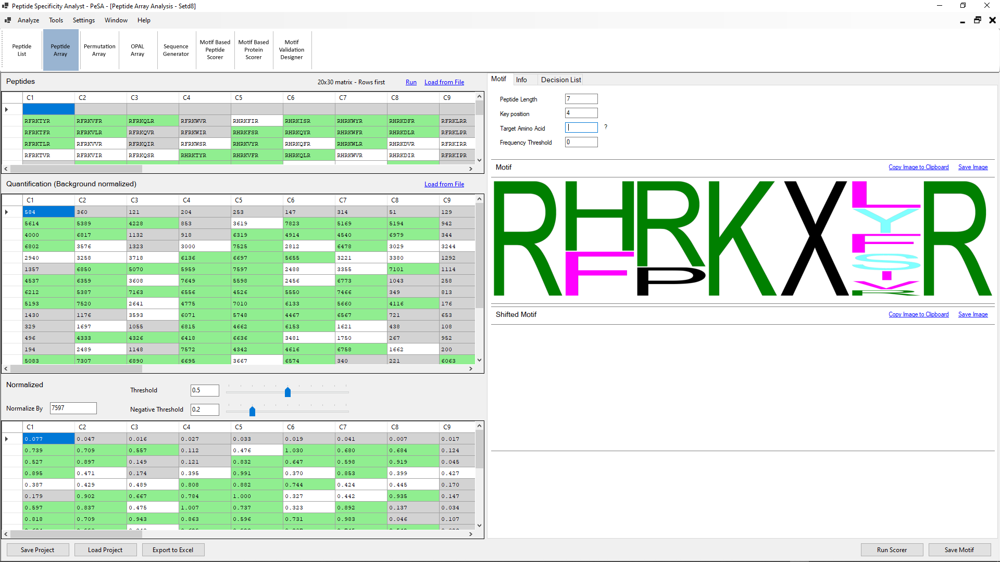

### Peptide Array:
Peptide array analysis is similar to peptide list analysis in that it creates a frequency-based motif. However, the provided input is not only made up of peptides that go through positive interaction but the full data set of a study.

#### User Input:
- **Peptides:** The peptide array can be fed to PeSA as a list of peptides or in an array format, using the **Load from File** link. If a list is used as the input, a matrix is generated using the default number of rows and columns set in the settings menu. The user also sets whether the matrix will be generated as rows first or columns first in the settings menu.
- **Quantification (Background Normalized):** The background normalized quantification values must be loaded to PeSA for analysis. Direct copying from the clipboard is possible, as well as importing from an Excel file using the **Load from File** link.
- **Normalize By:** The background normalized quantification values of the peptide array are further normalized to have a similar scale across multiple studies. The background quantification values are divided by this "Normalize By" value. It is by default set to the maximum value in the quantification matrix but can be overridden by the user.
- **Threshold:** The normalized values greater than or equal to the threshold value are accepted to have gone through the positive interaction studied in the array. The list of peptides that have values greater than the threshold is used to generate the frequency-based motif. A shifted motif is also created using the same list of peptides using the criteria explained above with target position and key amino acid.
- **Negative Threshold:** The normalized values smaller than the negative threshold value are considered to belong to peptide sequences that have not gone through positive interaction. Any peptide sequence having a valuer between the threshold and the negative threshold is considered inconclusive.
-  **Run:** This command will run the motif generation tool with the entered data and parameters.

#### PeSA Output:
- **Normalized:** The further normalized array by the **Normalize By** value described above.
- **Motif:** The motif tab displays the frequency-based motif generated and the shifted motif in case of target position, and key amino acid values are defined.
- **Info:** The information entered here is not used by PeSA for analysis. It is a place for the researcher to keep the original image together with the analysis.
- **Decision List:**  The decision of which peptides have or have not gone through positive interaction based on the threshold and negative threshold values are listed in a list format.

#### Further Features:
- **Save/Load Project**: The analysis data and the configuration values can be saved in a JSON format for easy access. PeSA uses .ppep extension for peptide array analysis projects.
- **Export to Excel**: PeSA can export all the input and output data of the analysis as an Excel file, presenting both the raw and processed data to the user. The exporting capability allows full access to the data in case further analysis not covered by PeSA needs to be done on the dataset.
- **Run Scorer**: Provides a direct link to the **Motif Based Peptide Scorer** and **Motif Based Protein** modules explained below.
- **Save Motif**: The motifs are saved in a format that PeSA's other modules can open.
