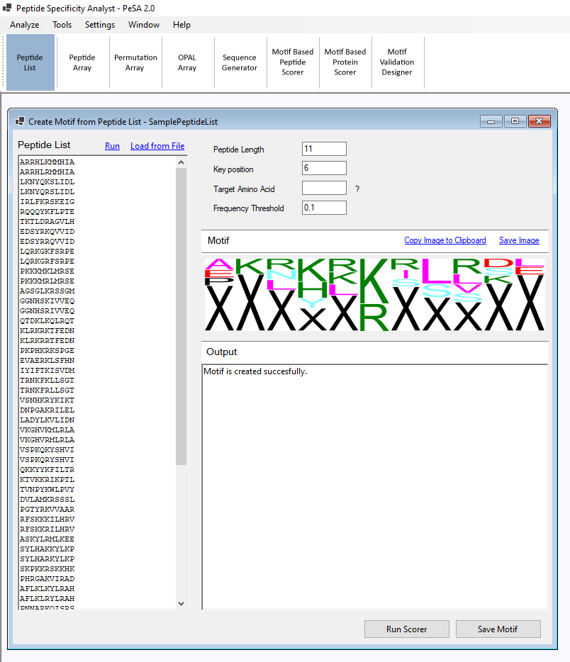

### Peptide List:
In this module, PeSA generates a sequence motif using the frequency of each amino acid residue at each position in the given peptide list. In the case of a key position and target amino acid supplied, an alternative 'shifted' motif is generated for the peptides in the list but does not match the target key and position rule.

#### User Input:
- **Peptide List:** The list of peptides can be loaded by using the **Load from File**, or it can be directly copied to the list from the clipboard. As in all PeSA modules, the peptides read are handled in a case-sensitive manner.
- **Peptide Length:** By default, the length of the first peptide in the peptide list is considered the motif length. This value can be overridden by the user if there are extra characters at the end of the peptides that need to be excluded from the analysis. If any peptide has a length larger than this set peptide length, the extra characters at the end will be ignored.
- **Key Position:** This field is meaningful only if the Target Amino Acid parameter is also set. If these two values are defined, peptides in the list are split into two: The ones with the target amino acid at the key position and those without. As a result, two motifs are created as regular and shifted motifs, as described in 2.2.3. If any of the Key Position and Target Amino Acid fields are left blank, only one motif is generated to represent the whole peptide list.
- **Frequency Threshold:** An amino acid residue must be observed at a certain frequency or above at a specific position to be represented in the motif. The frequency threshold represents this threshold.
- **Run:** This command will run the motif generation tool with the entered data and parameters.

#### PeSA Output:
- **Motif:** The main, and if generated the shifted motif, will be displayed here.
- **Output:** If a shifted motif is generated as described above, the details on which direction a peptide is shifted are listed in the output window.

#### Further Features:
- **Run Scorer**: Provides a direct link to the **Motif Based Peptide Scorer** and **Motif Based Protein** modules explained below.
- **Save Motif**: The motifs are saved in a format that PeSA's other modules can open.
