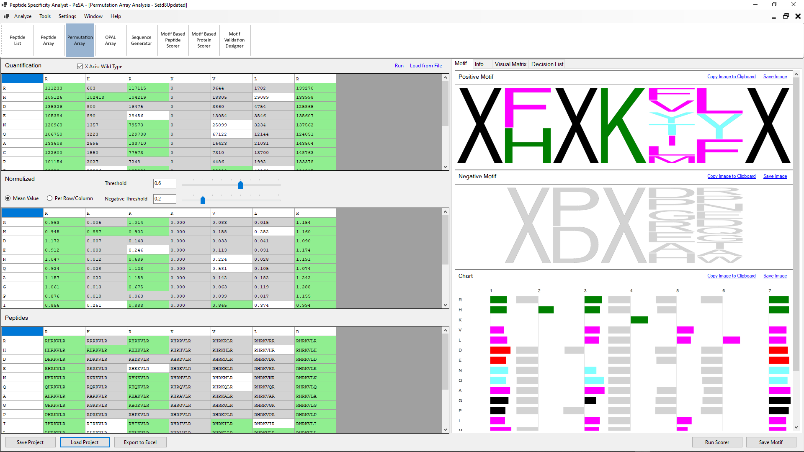

### Permutation Array:
PeSA can generate weight-based positive and negative motifs using numeric values of a permutation array.

#### User Input:
- **Quantification:** Background normalized quantification values need to be fed to PeSA for analysis by using the **Load from File** link or by directly pasting from the clipboard.  The wildtype sequence, as well as the order of the permutation sequence, should be included in the input array as row and column headers.
- **X-Axis Wildtype:** PeSA automatically determines whether the column or row header represents the wild type or the permutation sequence with the simple logic that the permutation sequence should not have any repeating amino acids. In the case of the wildtype sequence consisting of non-repeating characters and the decision is not straightforward, the user can define whether the X-axis (i.e., column headers) contains the wild type or not. If unchecked, the wildtype sequence is represented in the y axis of the array (i.e., row headers).
- **Y-Axis** Top to Bottom: In the case of the y-axis representing the wildtype sequence, for the correct directionality of the motif, the user can define whether the first character of the wildtype sequence is the one on the top or the bottom.
- **Threshold:** The normalized values greater than or equal to the threshold value are accepted to have gone through the positive interaction studied in the array. The list of peptides that have values greater than the threshold is used to generate the frequency-based motif. A shifted motif is also created using the same list of peptides using the criteria explained above with target position and key amino acid.
- **Negative Threshold:** The normalized values smaller than the negative threshold value are considered to belong to peptide sequences that have not gone through positive interaction. Any peptide sequence having a value between the threshold and the negative threshold is considered inconclusive.
- **Mean Value** and **Per Row/Column**: Background normalized quantification values are further normalized by dividing all values by the value of the wildtype sequence. As there can be as many wildtype sequences in the permutation array as the length of the wildtype sequence's length -1, there comes the question of which value to use for normalization. The option is whether the normalization will be done using the mean value of the array or whether each row/column will be normalized by the mean value within that row/column. The decision should be based on the homogeneity of the expression across the autoradiography image of the array analyzed. If, for some reason, any rows or columns are expressed differently than the rest and the quantification values of different wildtype sequences are different across the array, using the 'Per Row/Column' option may generate more accurate results. Otherwise, 'Mean Value' is a reasonable approximate that averages the values of all of the wildtype sequence quantifications.
-  **Run:** This command will run the motif generation tool with the entered data and parameters.

#### PeSA Output:
- **Normalized:** The normalized array is calculated by dividing the quanitification array by the normalization value.
- **Peptides:** As only the column and row headers are provided to PeSA as the wildtype sequence and permutation sequence, PeSA automatically generates the peptide sequences represented at each array's position. This output can be useful to search for certain sequences within the array and confirm that 'X-Axis Wildtype' and 'Y-Axis Top to Bottom' settings are set properly.
- **Motifs:** Weight-based motifs are generated using the normalized values of the permutation array. Each amino acid's weight at a specific position is determined by the normalized weight of the peptide with that amino acid at that position. A **positive motif** is generated by using the peptides with normalized values larger than the threshold entered by the user. Similarly, a **negative motif** is generated using the peptides with normalized values smaller than the negative threshold value set.
- **Chart**: PeSA generates a bar chart display, incorporating positive and negative motif information within the same scale. The same numerical values used in the positive and negative motifs are used as the bar lengths. As the values are used directly rather than their ratio, as done in motifs, they can be used to compare different positions.
- **Visual Matrix**: A visual matrix is generated in gray or blue-red scale to represent the numeric values of the permutation array.
- **Info:** The information entered here is not used by PeSA for analysis. It is a place for the researcher to keep the original image together with the analysis.
- **Decision List:**  The decision of which peptides have or have not gone through positive interaction based on the threshold and negative threshold values are listed in a list format.

#### Further Features:
- **Save/Load Project**: The analysis data and the configuration values can be saved in a JSON format for easy access. PeSA uses the .pprm extension for permutation array analysis projects.
- **Export to Excel**: PeSA can export all the input and output data of the analysis as an Excel file, presenting both the raw and processed data to the user. The exporting capability allows full access to the data in case further analysis not covered by PeSA needs to be done on the dataset.
- **Run Scorer**: Provides a direct link to the **Motif Based Peptide Scorer** and **Motif Based Protein** modules explained below.
- **Save Motif**: The motifs are saved in a format that PeSA's other modules can open.
