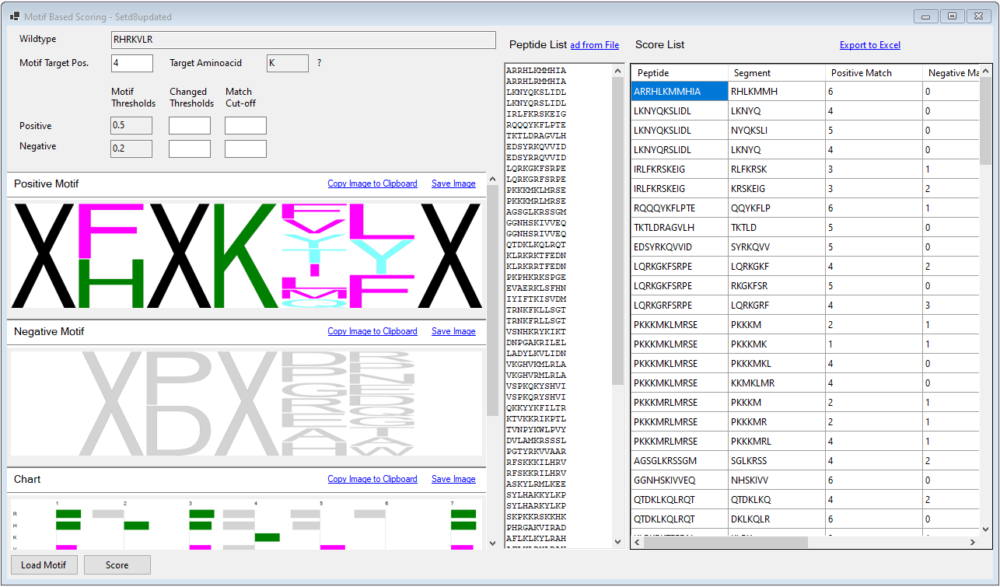

### Motif-Based Peptide Scorer:
PeSA-generated positive and negative motifs can be used to score a peptide list in terms of similarity to the motifs.

#### User Input:
- **Load Motif**: A PeSA-generated motif must be loaded by using the Load Motif button on the bottom left.
- **Wildtype (Display only)**: If the motif file contains a wildtype sequence, it will be displayed. It is used only if the motif target position is set.
- **Motif Target Position**: In a motif, there can be a central point that must match the scored peptides. For example, suppose the researcher is studying lysine methylation. In that case, it is more meaningful to score a peptide by aligning the lysine in it to the lysine in the wildtype sequence. The motif target position is the index of that specific position in the wildtype sequence. If such a position is not provided, for every peptide in the list to be scored, all the partial sequences within the peptide with the length of the motif will be scored separately.
- **Motif Thresholds (Display only)**: The positive and negative thresholds used to generate the motifs are displayed for informational purposes. These values can be used as a reference if the user wants to employ stricter thresholds.
- **Changed Thresholds**: The user can enter a positive threshold higher than the positive threshold of the motif. Similarly, a negative threshold smaller than the motif's negative threshold can also be used. For example, if the positive threshold is set as 0.6 in the motif, all the amino acid residues within the motif would have normalized values equal to or greater than 0.6. On the other hand, if a changed threshold of 0.8 is entered, the decision of a positive match would be more difficult. This is because only a normalized value of 0.8 would cause an amino acid to be considered a positive match. As an extreme example, entering zero as the negative changed threshold will practically ignore the negative motif in scoring.
- **Match Cut-off**: PeSA scores all the peptides to the given motifs by default. However, when working with a long peptide list, simply focusing on the peptides with at least a certain number of positive matches or at most a certain number of negative matches may be more efficient. These values can be entered through Positive and Negative Match Cut-Off entries. Even though scoring a few thousand peptide sequences takes only a few seconds (if a motif target position is provided), limiting the subset of output by match cut-off values can help save time in further analysis.
- **Peptide List:** The peptide list to be scored can be loaded from a file (**Load from File**) or pasted directly from the clipboard. The length of the peptides in the list does not need to match the length of the motif. Instead, scoring will be done by skimming each peptide segment of the motif size from left to right.
- **Score:** This button will run the scorer on the uploaded peptide list.

#### PeSA Output:
- **Score List**: The result is displayed in a list format. The columns include (1) Peptide, (2) Segment, and (3) all the calculated score values. Note that a peptide can have multiple scores if the length of the motif is shorter than the peptide or there are multiple positions in the peptide with a match to the 'Motif Target Position.' The region of the peptide that is scored is displayed under the 'Segment' column.

#### Further Features:
- **Export to Excel**: PeSA can export all the input and output data of the analysis as an Excel file, presenting both the raw and processed data to the user. The exporting capability allows full access to the data in case further analysis not covered by PeSA needs to be done on the dataset.
