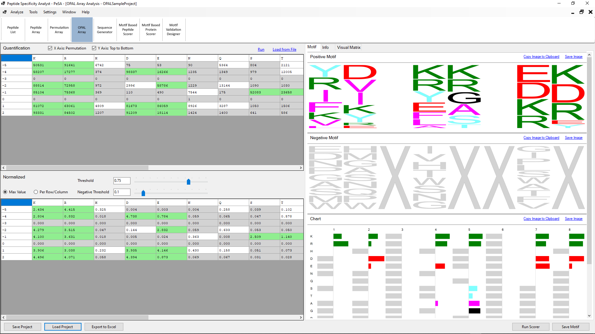

### OPAL Array:
OPAL array analysis is similar to permutation array analysis. Even though there is no wildtype sequence, each position in the array has only one single amino acid expressed more than others. By contributing the study results of a position to the amino acid with weight change in that position, PeSA creates positive and negative motifs using the positive and negative thresholds defined by the user.

#### User Input:
**Quantification:** Background normalized quantification values of the OPAL array are required as the input for analysis. The order of the permutation sequence should be included in the input array as a row or column header.
**X-Axis: Permutation:** PeSA automatically determines whether the column or row header represents the permutation sequence.
**Y-Axis Top to Bottom**: In the case of the x-axis representing the permutation sequence, for the correct directionality of the motif, the user can define whether the first character of the peptide is the one on the top or the bottom.
- **Threshold:** The normalized values greater than or equal to the threshold value are accepted to have gone through the positive interaction studied in the array. The list of peptides that have values greater than the threshold is used to generate the frequency-based motif. A shifted motif is also created using the same list of peptides using the criteria explained above with target position and key amino acid.
- **Negative Threshold:** The normalized values smaller than the negative threshold value are considered to belong to peptide sequences that have not gone through positive interaction. Any peptide sequence having a value between the threshold and the negative threshold is considered inconclusive.
- **Max Value** and **Per Row/Column**: The option whether the normalization will be done using the max value of the array or whether each row/column will be normalized by the max value within that row/column. The decision should be based on the homogeneity of the expression across the autoradiography image of the array analyzed. 
-  **Run:** This command will run the motif generation tool with the entered data and parameters.

#### PeSA Output:
- **Normalized:** Background normalized quantification values are further normalized by dividing all values by a specific normalization value.
- **Motif:** Weight-based motifs are generated using the normalized values of the OPAL array. A **positive motif** is generated by using the amino acid corresponding to array positions with normalized values larger than the threshold set by the user. Similarly, a **Negative motif** is generated using the array positions with normalized values smaller than the negative threshold value set.
- **Chart**: PeSA generates a bar chart display, incorporating positive and negative motif information within the same scale. The same numerical values used in the positive and negative motifs are used as the bar lengths. As the values are used directly rather than their ratio, as done in motifs, they can be used to compare different positions.
- **Visual Matrix**: A visual matrix is generated in gray or blue-red scale to represent the numeric values of the permutation array.
- **Info:** The information entered here is not used by PeSA for analysis. It is a place for the researcher to keep the original image together with the analysis.
- **Decision List:**  The decision of which peptides have or have not gone through positive interaction based on the threshold and negative threshold values are listed in a list format.

#### Further Features:
- **Save/Load Project**: The analysis data and the configuration values can be saved in a JSON format for easy access. PeSA uses the .pprm extension for permutation array analysis projects.
- **Export to Excel**: PeSA can export all the input and output data of the analysis as an Excel file, presenting both the raw and processed data to the user. The exporting capability allows full access to the data in case further analysis not covered by PeSA needs to be done on the dataset.
- **Run Scorer**: Provides a direct link to the **Motif Based Peptide Scorer** and **Motif Based Protein** modules explained below.
- **Save Motif**: The motifs are saved in a format that PeSA's other modules can open.
